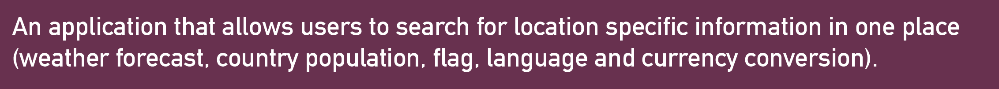
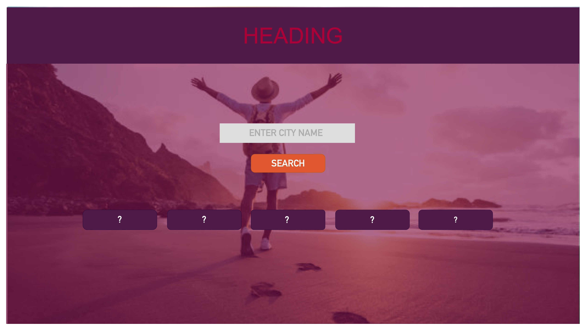
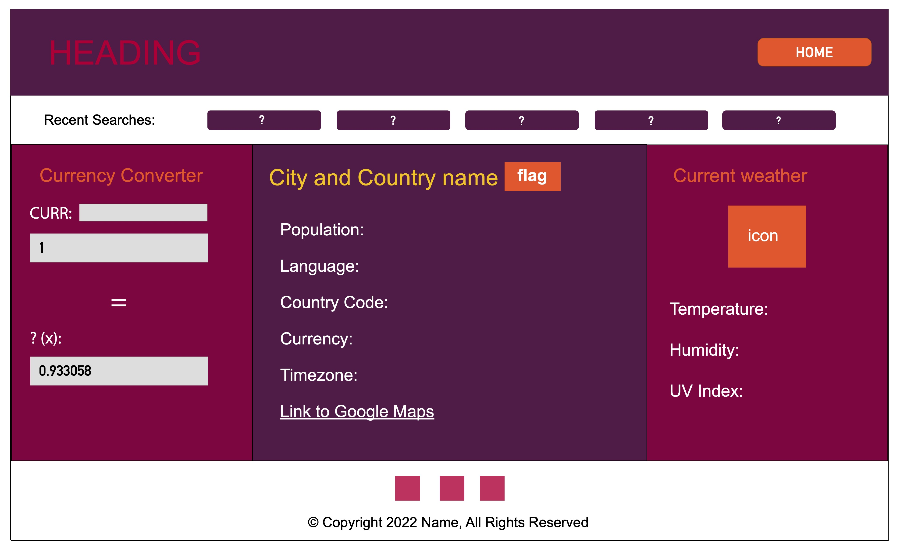
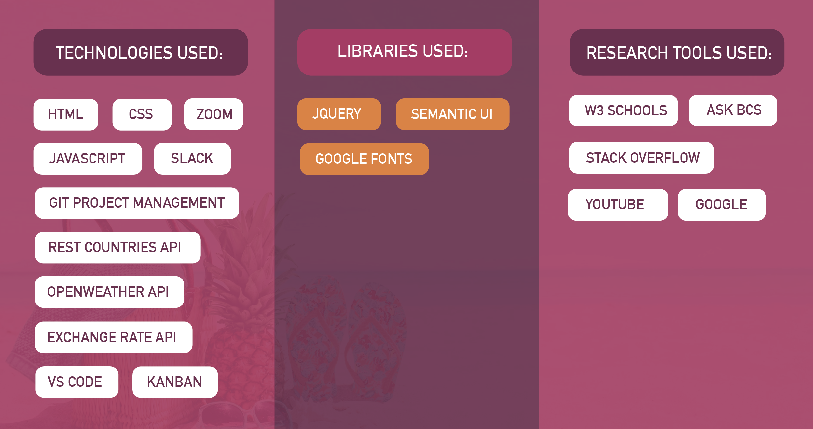
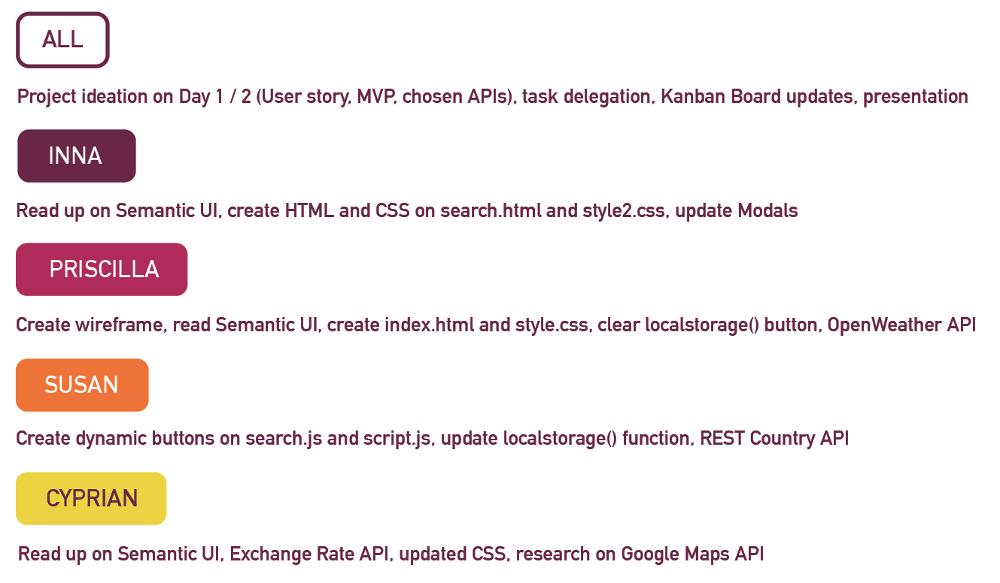
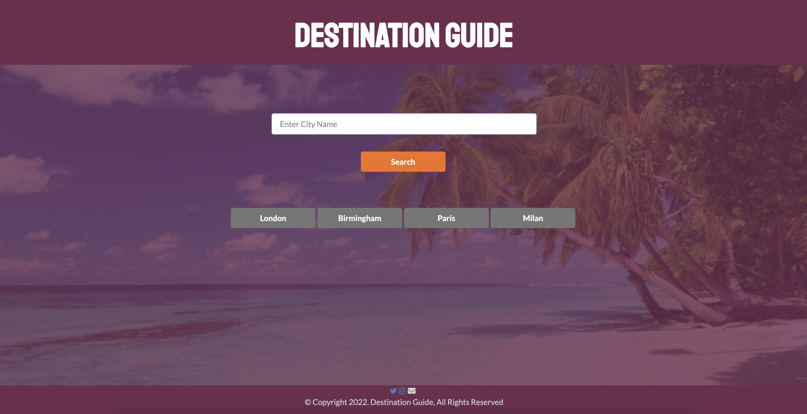
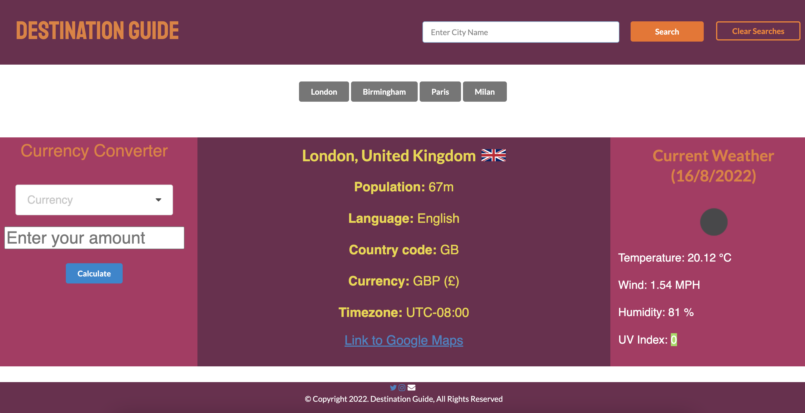

# destination-guide

**Destination Guide, is an all-in-one application that offers a range of services such as currency conversion, country information and weather information for tourists.** 

With just one search, we bring together these services to provide convenience and efficiency for the user. Rather than, having to switch back and forth across multiple separate applications, Destination Guide gives you the same information, easier and faster. 

Project contributors: Priscilla, Inna, Susan and Cyprian.

**Our User Story:**

 

**MVP (Minimum Viable Product):**

 

**Motivation for Development:**

To create ease and convenience for users -  a “one-stop-shop” giving them all the neccessary information about the search location, as opposed to visiting several separate applications for currency conversion, weather information, local information etc. 

## Wireframe:
We approached this task by first creating a wireframe on Adobe InDesign to map out what elements are required:

 

 

## Processes:

 

## Breakdown of Tasks and Roles:

## Ideas for Future Development:

* Implement Google Maps feature on search page, where user is taken to search city (not country).
* Interactive maps where user can search for attractions nearby and drop pins on places they’d like to visit. 
* Include city specific information - find a city API. 
* Include language translation API.

## Screenshot of Application:

## URL to Deployed Application:

https://capg84.github.io/holiday-planner/
